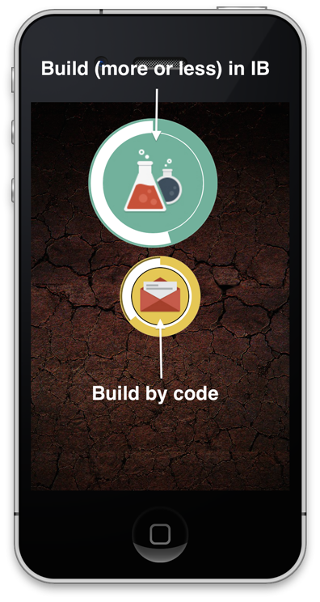
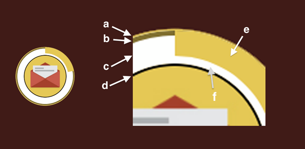

IBProgressButton
================

A combination of progress and button.  

This button is based on the work of Jose Luis Martinez de la Riva (http://martinezdelariva.com) who made a nice progressView. I just added some properties and made it additionally act as a button.

#Overview

The button can be created by code or by using the Interface Builder

#Customizing
There are several parameters to configure the appearance

##a) The border can be configured by 

    @property (assign, nonatomic) CGFloat borderWidth;
    @property (strong, nonatomic) UIColor *borderColor;
##b) The ring around the progress, that is covered by the progress arc is configured by

    @property (assign, nonatomic) CGFloat wrapperArcWidth;
    @property (strong, nonatomic) UIColor *wrapperColor;

##c) Thats the background color of the control
    @property (strong, nonatomic) UIColor *backgroundColor;

##d) The button border (border around the icon) can be configured by
    @property (assign, nonatomic) CGFloat buttonBorderWidth;
    @property (strong, nonatomic) UIColor *buttonBorderColor;
##e)The progress arc has many  options
    @property (assign, nonatomic) CGFloat progressArcWidth;
    @property (strong, nonatomic) UIColor *progressColor;
    
To set the progress value (0.0f - 1.0f)  you can use the methods

     - (void)setProgress:(CGFloat)progress animated:(BOOL)animate;
    - (void)setProgress:(CGFloat)progress duration:(CFTimeInterval)duration;

To stop and resume the animation ... yep, you´re right ...

    - (void)pause;
    - (void)resume;

##f) The free space is set with

    @property (assign, nonatomic) CGFloat spaceWidth;
and the color is the same as (c)

## Button inset
How much the button moves when pressed is set by  

    @property (assign, nonatomic) CGSize buttonPressOffset;

##Adding a method when the button is pressed

    - (void)addTarget:(id)target action:(SEL)selector forControlEvents:(UIControlEvents)controlEvent;

#Installation
Well, I would install it with CocoaPods ...

    pod "IBProgressButton"

but if you prefer it the conventional way, just include the files

**IBCircularProgressButton.h**
and
**IBCircularProgressButton.m**
in your project.
 
#License
I hate this stuff. So I chose MIT ... this seems the one that is the most liberal ;-)

Means: Do what you want (but keep in mind, that I took parts from *Jose Luis Martinez de la Riva* ... what a cool name ;-)